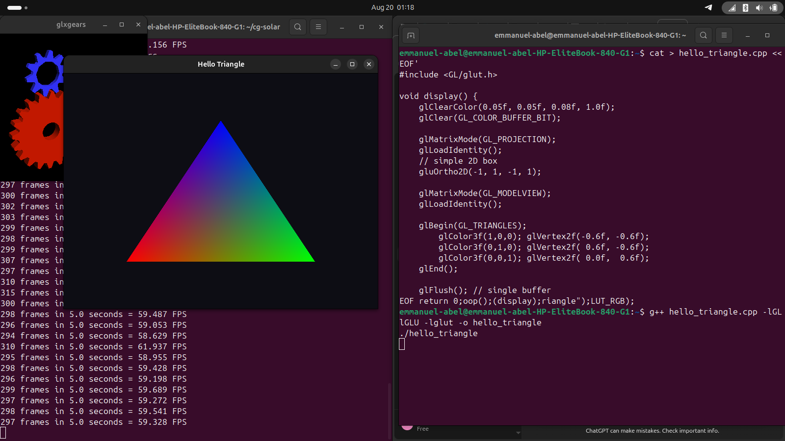
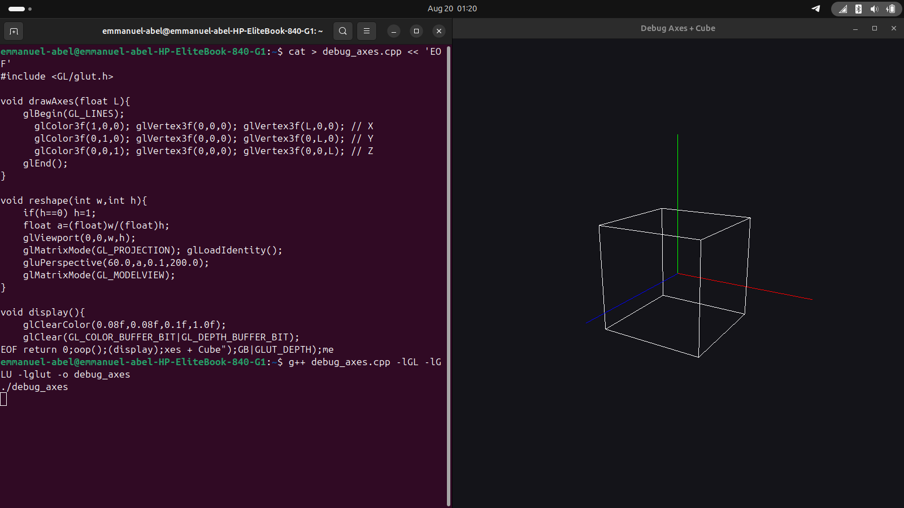
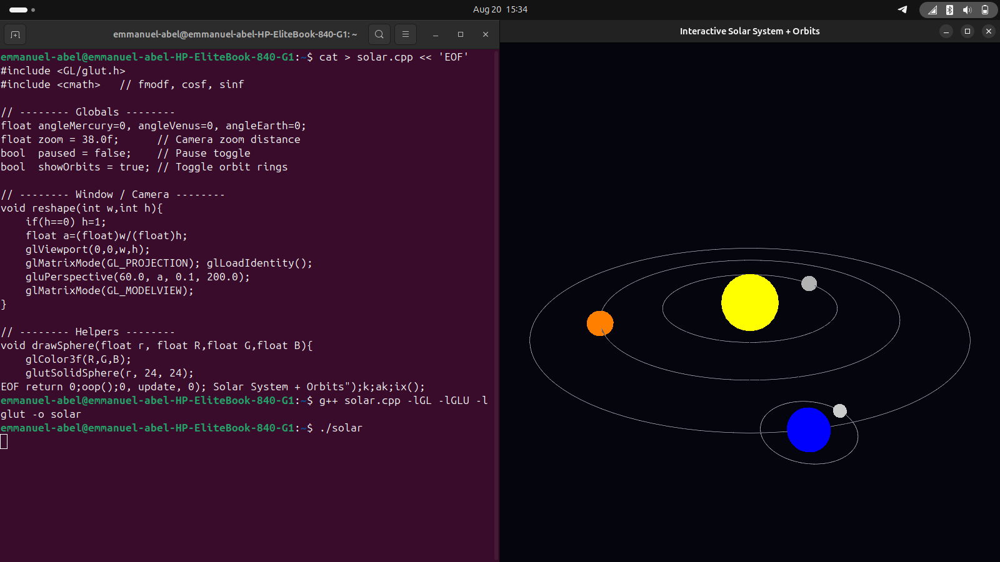
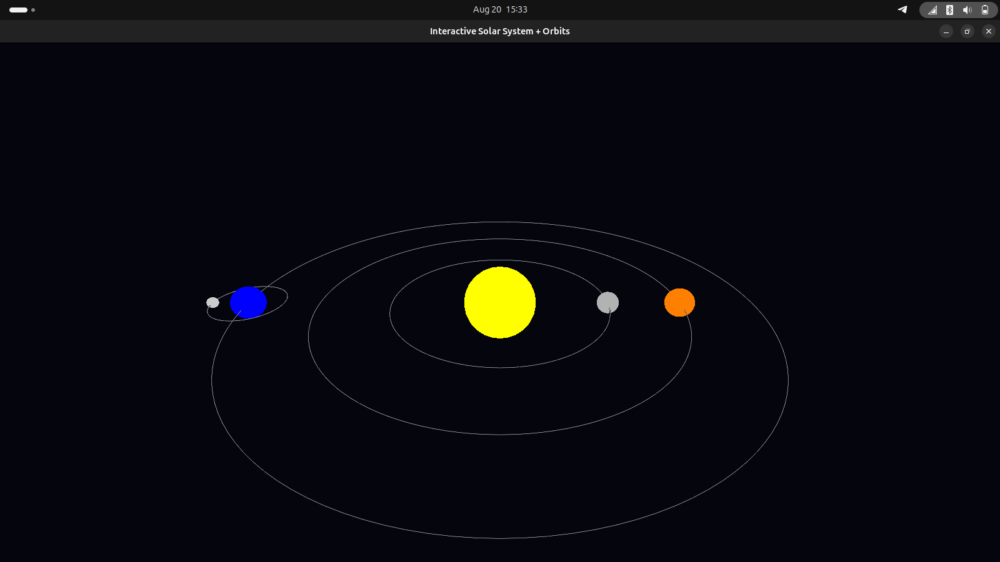

# 🌌 Solar System Simulation (OpenGL + C++)

This project demonstrates a simple interactive solar system using **OpenGL** and **FreeGLUT** in C++.

---

## ✨ Features
- Sun, Mercury, Venus, Earth, and Earth’s Moon.
- Orbit lines drawn using `GL_LINE_LOOP`.
- Hierarchical transformations (Moon revolves around Earth which orbits the Sun).
- Keyboard controls for zoom, pause, and orbit toggle.

---

## 🎮 Controls
- `+` / `-` → Zoom in/out  
- `p` → Pause/Resume animation  
- `o` → Toggle orbit display  
- `ESC` → Exit  

---

## ⚙️ Build & Run
---

## 📸 Results / Screenshots

### Initial Test


### First Sphere Render


### Solar System Running


### Zoomed-In View



```bash
g++ solar.cpp -lGL -lGLU -lglut -o solar
./solar
```
